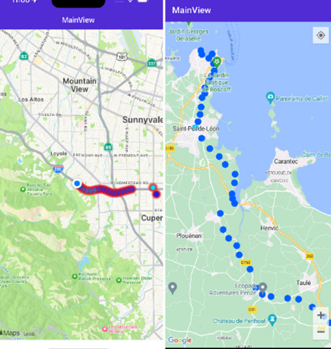

# Location Tracker App (.NET MAUI)

Tracks user locations and displays them as a heat map.

- C# / .NET MAUI
- Saves to SQLite
- Displays path as heatmap/polyline and pins for each point
- Multiplatform: Android, iOS, Windows

**GitHub:** https://github.com/amityadav137/Location-Tracker

## Features

- Tracks your location and stores coordinates locally
- Draws your path on a map with polylines (heatmap effect)
- Shows pins for each visited location
- Works cross-platform with .NET MAUI and SQLite

## Getting Started

1. Clone the repository
2. Open with Visual Studio 2022+ (with .NET MAUI workload installed)
3. Restore NuGet packages (`sqlite-net-pcl`, `Microsoft.Maui.Controls.Maps`)
4. Run on your device or emulator

## Screenshots

